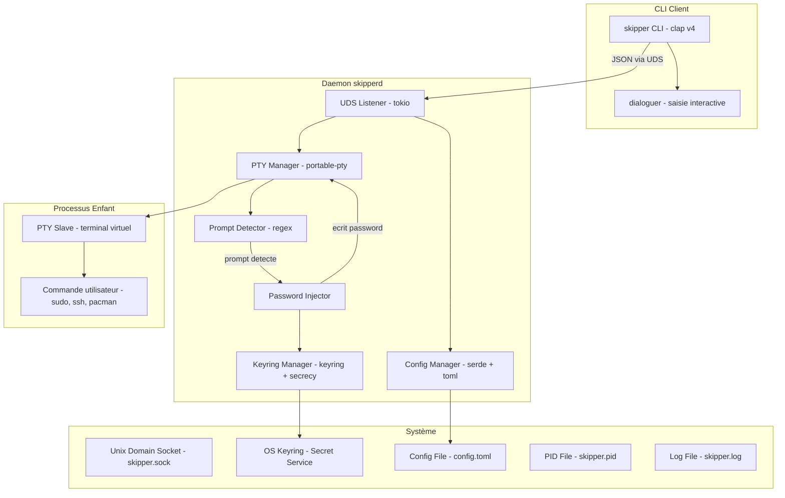

<div align="center">

  <h1>Skipper 360</h1>

  <p><strong>Gardien d'arrière-plan intelligent et sécurisé pour l'injection automatique de mots de passe dans les PTY Linux.</strong></p>

  <p>
    <a href="https://github.com/skjuve/skipper-360/actions"></a>
    <a href="https://crates.io/crates/skipper-360"></a>
    <a href="LICENSE-MIT"></a>
    <a href="https://rust-lang.org"></a>
    <a href="https://linux.org"></a>
  </p>

  <p>
    <a href="#-fonctionnalités">Fonctionnalités</a> •
    <a href="#-architecture">Architecture</a> •
    <a href="#-installation">Installation</a> •
    <a href="#dutilisation">Utilisation</a> •
    <a href="#-sécurité">Sécurité</a> •
    <a href="CONTRIBUTING.md">Contribution</a>
  </p>

  ---
</div>

## Présentation

**Skipper 360** est un outil CLI et daemon d'arrière-plan écrit en **Rust**. Il écoute et intercepte intelligemment les demandes de mot de passe (`sudo`, `ssh`, `pacman`, `gpg`, etc.) exécutées dans des pseudo-terminaux (PTY) virtuels et y injecte en toute sécurité vos identifiants configurés.

Fini la saisie répétitive de vos mots de passe en ligne de commande : Skipper 360 surveille vos sessions PTY, résout le bon mot de passe via le trousseau de clés de votre système d'exploitation (**OS Keyring**) ou un vault chiffré, et libère vos workflows sans compromettre la sécurité.

---

## Fonctionnalités

- **Sécurité Maximale** : Aucun mot de passe stocké en clair sur le disque. Intégration directe avec Secret Service (GNOME Keyring / KWallet / KeePassXC).
- **Détection Intelligente** : Détection des prompts password via regex configurables et vérification du mode `no-echo` de `termios`.
- **Whitelist Granulaire** : Associez des mots de passe spécifiques à des commandes ou serveurs cibles (`ssh user@prod`, `sudo pacman -Syu`).
- **Architecture Daemon + CLI** : Processus d'arrière-plan haute performance propulsé par **Tokio**, contrôlé via un socket Unix sécurisé (`0o600`).
- **Protection Mémoire** : Emploi systématique de `SecretString`, nettoyage immédiat mémoire (`zeroize`), verrouillage de pages (`mlock`) et désactivation des core dumps (`PR_SET_DUMPABLE`).
- **Notifications Configurables** : Mode *Standard* avec bip terminal et confirmation visuelle, ou mode *Silent* pour une discrétion totale.

---

## Tech Stack & Écosystème

| Composant | Technologie | Description |
| :--- | :--- | :--- |
| **Langage** |  | Performance, sécurité mémoire et concurrence sans datarace |
| **Async Runtime** |  | Gestionnaire E/S asynchrone non-bloquant pour le daemon |
| **CLI Parser** | `clap v4` | Parsing robuste des commandes, arguments et auto-complétion |
| **PTY Manager** | `portable-pty` / `nix` | Allocation et contrôle fin des pseudo-terminaux POSIX |
| **Keyring** | `keyring` + `secrecy` | Interfaçage natif avec les trousseaux d'accès OS et types protégés |
| **Sérialisation** | `serde` + `toml` | Configuration et protocole IPC JSON ultra-rapide |

---

## Architecture

Skipper 360 est structuré sous la forme d'un **workspace Cargo** modulaire découplé en trois crates distinctes :

```
skipper-360/
├── crates/
│   ├── skipper-cli/        # Client CLI d'interaction utilisateur (`skipper`)
│   ├── skipperd/           # Daemon d'arrière-plan PTY & injection (`skipperd`)
│   └── skipper-core/       # Core shared library (IPC, Keyring, Config, Types)
```



---

## Installation

### Via Cargo (depuis crates.io)

```bash
cargo install skipper-360
```

### Via Arch Linux (AUR)

```bash
yay -S skipper-360-bin
```

### Compilation depuis les sources

```bash
git clone https://github.com/skjuve/skipper-360.git
cd skipper-360
cargo build --release
```

---

## Guide d'Utilisation

### 1. Initialisation

Configurez votre nom d'utilisateur et enregistrez votre mot de passe par défaut dans le trousseau sécurisé :

```bash
skipper init
```

### 2. Démarrage du Daemon

Activez le service d'arrière-plan Skipper :

```bash
skipper activate
```

*Note : Vous pouvez également activer le service au démarrage via systemd :*
```bash
systemctl --user enable --now skipperd.service
```

### 3. Gestion de la Whitelist

Ajoutez des identifiants spécifiques pour des commandes dédiées :

```bash
# Ajouter une commande SSH spécifique avec son propre mot de passe
skipper whitelist add "ssh user@serveur-prod"

# Lister les entrées de la whitelist
skipper whitelist list

# Supprimer une entrée
skipper whitelist delete "ssh user@serveur-prod"
```

### 4. Exécution de Commandes Surveillées

Exécutez vos commandes via `skipper run` pour bénéficier de l'injection automatique :

```bash
skipper run ssh user@serveur-prod
```

---

## Modèle de Sécurité

La sécurité des identifiants est la priorité absolue de Skipper 360 :

1. **Aucune donnée sensible sur disque** : Le fichier `~/.config/skipper360/config.toml` ne contient que des méta-données et clés de référence.
2. **Encapsulation Secrecy & Zeroize** : Tous les mots de passe sont wrappés dans `SecretString` et leurs emplacements mémoire sont écrasés par des zéros dès leur destruction (`ZeroizeOnDrop`).
3. **Verrouillage Mémoire `mlock`** : Les pages contenant des données sensibles sont verrouillées afin d'empêcher leur écriture dans l'espace SWAP du système.
4. **Anti-Dump Processus** : Appel à `prctl(PR_SET_DUMPABLE, 0)` au lancement du daemon pour prévenir l'inspection via `/proc/PID/mem` ou les coredumps en cas de crash.
5. **Permissions Strictes IPC** : Le socket Unix accepte uniquement les connexions restreintes au propriétaire du processus (`0o600`).

---

## Contribution

Les contributions de la communauté sont les bienvenues ! Consultez le fichier [CONTRIBUTING.md](CONTRIBUTING.md) pour en savoir plus sur la configuration de l'environnement de développement et les règles de soumission de Pull Requests.

Merci de respecter notre [Code de Conduite](CODE_OF_CONDUCT.md) lors de vos interactions.

---

## Licence

Projet distribué sous la double licence **MIT** et **Apache 2.0**.
Voir les fichiers [LICENSE-MIT](LICENSE-MIT) et [LICENSE-APACHE](LICENSE-APACHE) pour plus de détails.
